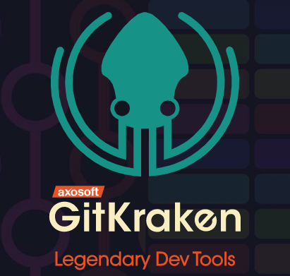
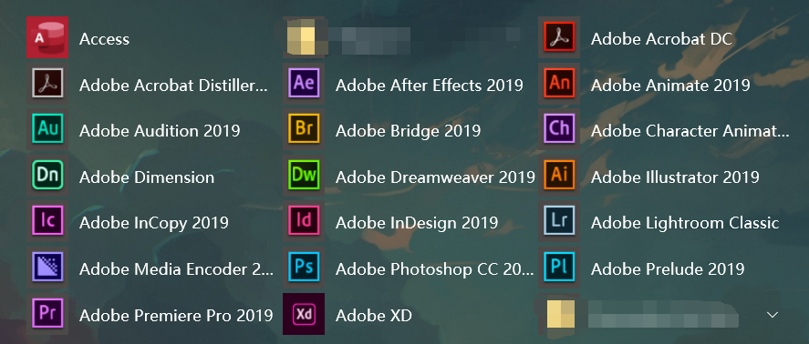
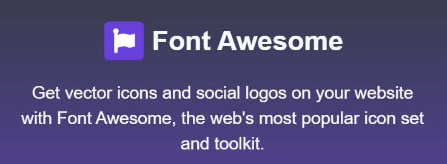
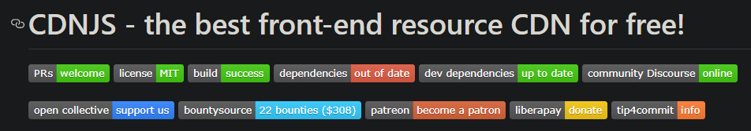
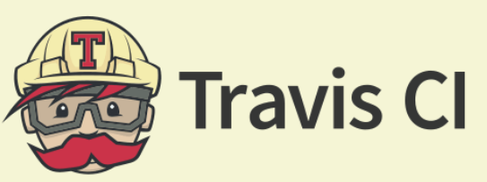
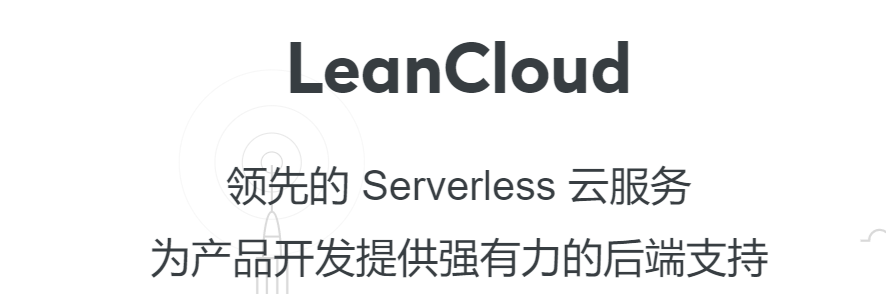
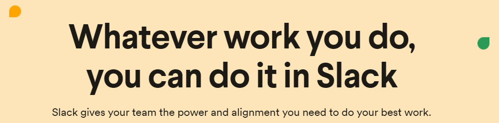

<h1 align="center">DaZaHui/先进生产工具搜罗和简介</h1>

      
    
    
    
    

## What is this?

**"DaZaHui/先进生产工具搜罗和简介"项目**，将会索引和搜集一些新手向的工具，并给出介绍和使用环境/案例，避免无谓的重复造轮子行为。

索引的工具将会根据开发过程中所服务的场景进行简易`Tag`，并遵循以下原则：

1. 价格便宜(5$/Mo或1￥/day)或者提供免费的社区版、拥有教育版资源。

2. 稳定，并尽量保证是商业化的产品而不是社区维护版。

3. 合法合规，在已知的情况下，没有暗藏后门/收费陷阱。

4. 我将会默认你申请了`GitHub Education Pack`，并拥有一些基本的网络访问能力、可以阅读英文和使用英文。

   

> - 项目将逐步更新，任何推荐请提`pull request`；同时，编写过程中难免会有疏漏，例如错别字、概念错误、文法紊乱等，请帮助我改正。
>- 由于是新手向，会穿插一些知识性内容的简单介绍；如果你比较熟悉这部分内容，可以直接跳过。
> - 可能会略长，使用`Ctrl+F`查询业务关键字能够直接跳到相应内容。

## 基础开发者包

1. GitHub黄书包(Education Pack)

    

>  **介绍**
>
>  由于其图标为一个黄书包而得名，实际上其真正的名字为`Education Pack`，及教育包。一旦申请成功，你将拥有大量的特殊优惠及免费的教育版软件/产品可用，而且参与Github该项计划的公司每年都在增加。如果你还没有申请过黄书包或者拥有一个GitHub账号，请务必把它当成"身为一名程序员"所必备基础知识。
>
>  **申请流程**
>
>  你需要拥有一个教育邮箱，即`xx@xxx.edu.xxx`；由于前几年有些人恶意注册`edu`邮箱和使用野鸡大学的邮箱薅GitHub的羊毛(国人不在少数)，因此只拥有`edu`邮箱实际上并不能保证申请到这个教育包。你还需要提供你的在校证明、成绩单、学生证件等至少一项内容，并且等待一周左右的时间。

- [申请地址](https://education.github.com/pack)

2. 乌龟Git(Tortoise Git)

    

> **介绍**
>
> 这是Windows平台上功能最强大的Git Shell图形化接口。好的Git Bash使用技能是必不可少的但并不是总是有价值的，图形化的操作能减少我们的大量重复操作时间。
>
> 需要注意的是，你还需要安装Git，并设置Tortoise Git的Git.exe地址；你不应当使用其它的shell或git软件(包括Tortoise Git自带的)对GitHub进行操作，详情可以自行搜索关键词。

- [官网地址](https://tortoisegit.org/)

3. 乌贼Git(GitKraken)

    

> 相比于Tortoise Git，GitKraken功能较弱，但拥有更好看的界面；大部分操作它也实现了图形化操作，并与GitHub深度结合，这一点是GitHub Desktop或Tortoise Git所不能比的。最重要的是，它是唯一一款稳定的跨平台Git GUI，可在Mac、Windows和Linux上运行。如果你无法使用Tortoise Git，你可以尝试这款软件。
>
> GitKraken已经加入GitHub黄书包，可以免费使用`Pro`版本的软件哦。

- [官网地址](https://www.gitkraken.com/)

4. Chrome

> **介绍**
>
> 如果你还没用过Chrome和它的相关插件，那么你一定无法理解为什么“去客户端化”变得如此流行。越来越快的网速和越来越大的内存给了我们更多使用Chrome的理由，赶紧删了你们电脑里各种充满了套路和广告的全家桶浏览器，使用Chrome吧。
>
> 我们开玩笑的时候总是说，编程就是“文档+搜索引擎”，所以一个好的浏览器是至关重要的。因此我把它放到了这个栏位里。

5. Typora

    

> **介绍**
>
> 世界上最好用的Markdown编辑器之一。
>
> 之所以把它放在这里，因为编写Markdown早已是程序员的必备技能。但是我发现还有很多人在使用落后的Markdown Pad之类的工具、依照那些古老的博客的指引固执地使用Sublime Text等文本编辑器，费劲地装各种插件以实现敲Markdown这样一个简单的需求。
>
> 为什么不直接使用这个免费又好用的编辑器呢？
>
> - 编辑即可视，再也不用把屏幕分成两半来预览效果了。
> - 各种主题可供选择和下载，满足程序员的爱美之心。
> - 启动速度快，配合`Win + Q` +`Typora`，会让你爱上使用Markdown写文章。

- [官网地址](https://www.typora.io/)

6. 火绒和AdGuard

    

> **介绍**
>
> 之所以要介绍这两款软件，是因为：**你不觉得你的电脑慢吗?**
>
> 过多的垃圾广告延缓了你的网页打开时间、各类追踪器不断记录你的上网数据，使得越来越多莫名奇妙的推销广告和电话找上门来，你不烦吗？
>
> 智商管家和数字助手不断在后台拖慢你电脑的运行速度，用子虚乌有的报警和各类防不胜防的弹窗打断你的思路，你不生气么？
>
> - 火绒，足够安静，以至于你会一度怀疑这软件到底有没有在后台运行；它屏蔽掉所有系统级别的不安全选项和弹窗、注册表修改、软件自动升级；在Win10已经足够安全的今天，一个小而精的安全软件，而且它时那样的安静乖巧，你给我一个不用它而去使用各类智商管家、智商卫士的理由？
> - 桌面版的AdGuard可能需要略微付费，但相对于你的个人隐私和因此节省的网页打开时间而言，这是非常值得的；另外，Chrome有免费的AdGuard插件可用，让你的网页瞬间清净。
> - 作为一个程序员，只有保证你的电脑足够敏捷、响应足够灵巧，才能够更优雅、更高效地编程，这是我把它们放在这个位置的理由。

- [火绒安全](https://www.huorong.cn/)

- [AdGuard](https://adguard.com/en/welcome.html)

7. terminus

    

> **介绍**
>
> 一说到SSH工具，很多人脑海里想到的是XSHELL。但是Terminus也是一款不错的SSH客户端，仅从正版的角度，它有以下优点：
>
> - 相比于XSHELL而言更便宜。
> - PC端永久免费，只不过没有SFTP功能（Pro版本有）。
> - Pro版本支持在移动端使用，这是XSHELL所不能企及的。
> - [更加详细的介绍](https://blog.whiterobe.top/2019/10/05/zh/terminus-intro/)
>
> 它已加入GitHub黄书包，绑定GitHub黄书包账户可以直接使用Terminus Pro的功能。

- [官网地址](https://www.termius.com/)

8. Adobe全家桶

    

> **介绍**
>
> 你可能要问，我一个程序员为什么要知道这些？
>
> 事实上，虽然Adobe全家桶设计师用得多一些，但一些基础的应用水平，对于一名个人开发者而言是必不可少的。比如简单的修图、抠图、音频修正、视频剪辑等等等，利用这些流媒体创作软件，可以更好地展示你的项目。
>
> 我会在下面列出一些比较基本的Adobe软件使用技能。

- [官网地址](https://www.adobe.com/)

|        名称         |       介绍        |                作用                |                             链接                             |
| :-----------------: | :---------------: | :--------------------------------: | :----------------------------------------------------------: |
|   Adobe Photoshop   |   图片编辑软件    |              抠图修图              | [中文官网地址](https://www.adobe.com/cn/products/photoshop.html) |
|      Adobe XD       |   UX/UI设计平台   |     进行网页或APP动效图的制作      |  [中文官网地址](https://www.adobe.com/cn/products/xd.html)   |
| Adobe After Effects | 视频编辑/特效软件 |             视频剪辑等             | [中文官网地址](https://www.adobe.com/cn/products/aftereffects.html) |
|  Adobe Illustrator  | 矢量版画设计软件  |           画画，陶冶情操           | [中文官网地址](https://www.adobe.com/cn/products/illustrator.html) |
| Adobe Premiere Pro  |   视频编辑软件    | 跟会声会影差不多的简单视频剪辑软件 |              [官网地址](https://www.adobe.com/)              |

9. LastPass

    

> **介绍**
>
> 你可能会有很多账号，但是如果只用同一个密码或者简单改几个字符，还是非常容易被撞库攻击的。
>
> LastPass可以直接集成到Chrome或是你的手机客户端，你可以保存一些不怎么重要的账号和密码到这款软件上(切记直接生成非常复杂的密码进行存储)；比如Nvidia开发者账号、Spotify音乐账号、各种临时注册的无所谓的账号等。
>
> 当然，对于大部分人来说，免费版就够用了。

- [官网地址](https://www.lastpass.com/zh)

10. 支持差分的云盘

    
    

> **介绍**
>
> 此处的云盘指的不是百度云盘这种纯存储的云盘。
>
> 假设你有这种需求：你需要在一个电脑编辑一个文件，但是临时需要回家一趟，你这时候可能需要把未做完的这个软件保存然后通过QQ等软件发送到家里的电脑上。不觉得很麻烦吗？
>
> 所以我要推荐“坚果云”、“腾讯微云”等差分云盘软件，这些软件可以自动扫描指定文件夹中的文件所发生的变动，然后仅仅把变动跟云端同步，这样你所有的设备都会收到这些变动。
>
> 下一次，带上你的笔记本，享受随时随地敲键盘的快感把。

11. Docker

    

> **介绍**
>
> 无论是学术届还是软件开发，对Docker的使用已经越来越普遍。用比较通俗的说法来介绍Docker：
>
> - 把操作系统、依赖、环境变量和你所开发的应用等等等通通打包，这样在发布后别人使用你的应用无需从头开始搭建各类环境。

- [官网地址](https://www.docker.com/)

12. JetBrains全家桶

    

> **介绍**
>
> JetBrains系列的IDE的强大毋庸置疑，如果你还在使用落后的Eclipse或者Sublime等工具编辑你的代码，你最好走出你的编程舒适区，用一点时间来适应JetBrains的产品，你会发现在它所构建的开发环境下开发是多么愉快的一件事。当然，它也有它的缺点，比如启动速度慢、吃内存较大之类的问题。但你需要很频繁的打开关闭某几个文件么？你缺内存条么？
>
> - 不要再给自己的懒惰找借口和向从课堂/博客上学来的那些落后生产力妥协。
> - 学生或者GitHub黄书包可以申请免费的全家桶。等于一年给你省了几千美金，这么良心的公司你为什么反感？
> - 有中文客服，你可以使用中文提交工单，工作日内必答复。

- [官网地址](http://www.jetbrains.com/)

## 云服务产品

云服务是一个大类，也是本工具索引集的主要内容。这里简单介绍[SaaS(软件即服务)、PaaS(平台即服务)和IaaS(基础架构即服务)](index/cloud_intro.md)。

> 事实上，除了少部分产品，大部分先进工具早已或即将依托于云服务，因此如果不做具体说明的话，我会把大部分工具归在这一类。

---

1. Algolia

    

> **介绍**
>
> 你可以认为Algolia是PaaS或者SaaS，因为它是如此的强大：**搜索细化、关键词联想、产品分析、智能推荐、语音搜索、基于地理位置的搜索优化**......
>
> - 如果你还在为你的博客或站点做站内搜索而苦恼，你可以使用Algolia在半小时内完成这个功能。
>
> - 要知道，一个男人和女人搜索“食物”时，完全可能出现两种结果，这种搜索细化业务Algolia也已经帮你实现。
>
> - 如果你在GitHub上有一个不错的项目，你想做一个类似Vue一样的文档内关键词检索，Algolia也已经为你提供了[免费的服务](https://community.algolia.com/docsearch/)。
>
> - 合理合法，在中国大陆有自己的节点。
>
> Algolia加入了GitHub黄书包。

- [官网地址](https://www.algolia.com/)

2. CloudFlare

    

> 全球最大的网站安全管理、性能优化及相关的技术支持商。
>
> - 有效避免你的网站被DDOS攻击、对你的网站流量进行有效监控和信息统计等等等。
>
> - 合理合法，在中国大陆有节点。
>
> - 最重要的是，提供了免费的DNS解析和CDN服务。

- [官网地址](https://www.cloudflare.com/)

3. Zenodo

    

> **介绍**
>
> **Zenodo** 是一个多学科研究产品储存库，支持各种内容，包括刊物、演示文稿、论文集、项目、图像、软件（包括与 GitHub 的集成）以及所有语言的数据，由欧洲核子研究组织 (European Organization for Nuclear Research, CERN) 维护。
>
> - 把你的软件/论文成果发布到Zenodo上，会为你生成一个DOI(数字对象唯一标识符)。
> - 生成一个Badge，可以放到GitHub上展示，如：。
> - 你的DOI将会终生保存，并且DOI将会有利于你项目的传播与分享。
> - 与GitHub深度集成，你的每一次Release都会自动触发Zenodo的API，为你生成DOI。

- [官网地址](https://zenodo.org/)

4. 免费Logo设计-U钙网

    

> **介绍**
>
> 这是一个国内的网站，可能只在小众圈子里比较出名。尽管这个网站连SSL证书都没钱买，但是它的服务确实是很不错的。
>
> 如果你不想费太多心思设计的你的项目的LOGO或是一些个人用的头像，你不妨试试这个网站。比如，这个项目的LOGO就是我用了30s在这个网站生成的。
>
> - 免费，不用注册。真的是良心项目，站长用爱发电。
> - 大量LOGO模板和字体可供选择。

- [官网地址](http://www.uugai.com/)

5. Font Awesome

    

> **介绍**
>
> 一个字体图标库，提供了大量的标准化图标以供使用。阿里有类似的产品，但是都要收费而且量不是很全。
>
> - 一个网站或者一个微信小程序中总是要用到大量的标准化图标，程序员不可能说既能写代码又能做设计；如果你是一个单打独斗的程序员，没有强有力的美工帮你，你就需要用到大量此类图标来美化你的网站。
> - 不幸的事，由于这个网站用了亚马逊的云服务器，所以在国内访问不太稳定，因此我们需要把要用的图标集合都下到本地作为离线图标用——可能需要搭配下文介绍的`cdnjs`进行使用。

- [官网地址](https://fontawesome.com/)

6. cdnjs

    

> **介绍**
>
> 你可以把你的js、CSS、Image等根据[相关协议](https://github.com/cdnjs/cdnjs)发布到GitHub上，别人就可以利用CDN技术更快的访问你所发布的内容。理论上你可以使用它做图床，甚至是免费博客站点加速网络。
>
> 其次，我们开发网页时会用到各种在线的js库或者样式表，你从这个网站获取相应的内容速度会非常快，有利于优化你的程序打开时间，甚至节省服务器的流量开销。
>
> - 再举一个深一点的例子：你要使用`JQuery.js`，你如果选择本地保存这个文件`<script src="./JQuery.js"/>`，用户打开你的网站都要从你的服务器拉取这个文件，这个过程就要消耗你服务器的流量，并且如果你的服务器性能不是很好，拉取文件的速度也会很慢；但如果用了`cdnjs`，用户将会从附近的内容分发网络获取文件，也就意味着会从一个质量更为优异的节点拉取这个文件，同时也替你省了服务器流量、加快了网站打开速度。
>
> 所以，如果你之前不知道`cdnjs`，请现在立刻去了解它并使用它。

- [官网地址](https://cdnjs.com/)

7. Travis CI

    

> **介绍**
>
> 一个持续化自动测试平台，可以与GitHub挂钩，你的每次推送都将自动进行测试。
>
> - 好的测试决定了你的代码质量，并给了别人使用你的代码的理由。
> - 可以获得一个酷炫的Badge：。
> - 与GitHub深度集成。

- [官网地址](https://travis-ci.org/)

8. Coveralls

    

> **介绍**
>
> 同样，这还是个测试相关的平台，可以与GitHub和Travis CI进行集成，对代码的测试覆盖率进行统计和记录。
>
> - 你可以获得一个Badge： 。
> - 只有经过良好测试的代码，才更容易被复用。
> - 没有编写测试样例的代码都是垃圾代码。
> - 与GitHub深度集成。

- [官网地址](https://coveralls.io/)

9. Better Code Hub

    

> **介绍**
>
> 这个网站将会依据《[Building Maintainable Software](https://www.amazon.cn/dp/B01B6WS86I)》一书对你的代码质量进行检测，用实打实的数据告诉你，你的代码哪里写的不好哪里需要改进。
>
> - 与GitHub深度集成。
> - 对于公共仓库，检测是免费的。
> - 获得一个酷炫的Badge：。

- [官网地址](https://www.bettercodehub.com/)

10. Shield.io

    

> **介绍**
>
> 你是否想过别人GitHub仓库README上那些花花绿绿的徽章是怎么弄的？
>
> - 徽章可以使你的项目看起来更专业。
> - 徽章可以用最简短的信息告诉别人你的项目的基础信息。

- [官网地址](https://shields.io/)
- [项目地址](https://github.com/badges/shields)

11. Lean Cloud

    

> **介绍**
>
> Lean Cloud是国内最早推出Serverless概念的公司，可以说在微信小程序没有推出云开发之前，Lean Cloud是最早支持云开发的公司，不少独立开发者都基于它的服务构建了自己的小程序。它的产品主要包括：**数据存储、云函数/云开发、即时通讯、游戏解决方案(排行榜/匹配等)、邮件/短信推送**。
>
> - 大部分产品都提供**免费**的套餐，对于个人开发者而言完全是足够的。
> - 稳定，在国内有大量节点，符合各类政策法规。
> - 你可以用它来构建站内搜索(尽管我更推荐使用Algolia来做这件事)。
> - 可以用来构建静态站点的留言等需要动态数据交互的内容。
> - 可以很方便地构建微信小游戏的各类基础业务，如排行榜等。
> - 如果你对以上内容都不感兴趣，你可以简单把它当成一个免费的数据库，往里面存各类数据。
> - 邮件推送和短信推送，比如用于构建你的密码重置服务、登录确认服务、手机号确认服务等。

- [官网地址](https://leancloud.cn/)

12. Mailgun / SendGrid

    
    

> **介绍**
>
> Mailgun是非常强大的邮件推送系统，重要的是，如果月推送在10k封邮件以下，是完全免费的——相比之下，阿里云限定了日推送免费200封，对于个人开发者而言，Mailgun的性价比显然更高。
>
> 而另一方面，SendGrid则提供了首月40k免费的邮件推送量，之后为`100/mo`(这一点远不及阿里云，但可以作为备用方案使用)。
>
> - Mailgun的峰值邮件推送速度可达25k封/s，是业界顶尖水平。
> - 你可以用它们来发送邮件验证码，比如密码重置服务、登录确认服务等。
> - 对于邮件内容的审核没有阿里云严格，避免突然被BAN掉导致业务被迫下线的风险。
>
> 它们都已加入GitHub黄书包，你可以在一定程度上免费使用它们。

- [Mailgun官网地址](https://www.mailgun.com/)

- [SendGrid官网地址](https://sendgrid.com/)

## 社群产品

1. Slack

    

> **介绍**
>
> Slack是一个社群交流工具，你可以把它比作是一个Q群之类的东西，但是其更为高效。
>
> 和QQ等工具不同，Slack采用Workspace(以下简称Group)的形式进行人员组织；每一个组织是一个Group，你在每个Group都要单独注册一个账号(邮箱注册即可，很简单)。
>
> 好处就在于严格划分了你的账号的职能范围，不会出现类似微信那种工作强行侵袭个人生活的情况；但与此同时会产生大量碎片账号——这也是我什么会在前文推荐`LastPass`这种软件的理由。
>
> 作为一个软件开发者，你会发现在Slack上，有很多有着相同兴趣爱好的人聚在一起讨论一件事，如果你渴望跟全世界的开发者一起讨论开源项目或是某种技术，你应当尝试Slack。

- [官网地址]()

2. Stack Overflow

   
    

> **介绍**
>
> 专业的BUG讨论社区，后来慢慢发展成了一个类似领英一样的求职网站。
>
> - 你可以在Stack Overflow讨论任何你遇到的Bug，总会有非常Nice的人帮你解决问题。
> - 社区回答的质量都比较高，是因为他们遵从了[严格的提问和回答格式/要求](https://www.jianshu.com/p/4040622dc2ec)。
> - 同时，由于是个全球性质的问答社区，因此对你的英文水平要求较高。
> - 和GitHub的`Contribution`一样，你在Stack Overflow上的`Reputation`将使得你的简历变得出彩。
> - 《[为什么程序员一定要会用Google和Stack Overflow？](https://blog.csdn.net/u012207345/article/details/81139665)》

- [官网地址](https://stackoverflow.com/)